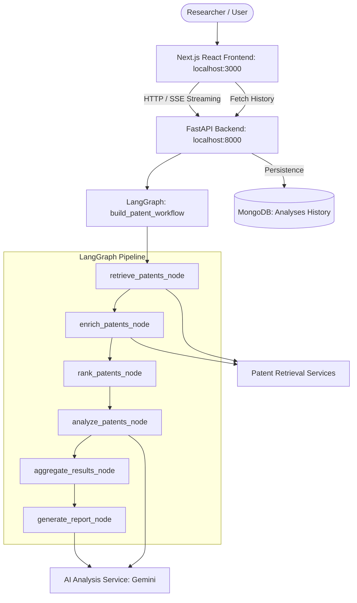

# PatentPilot 🧬🔬
> AI-Assisted Freedom-to-Operate (FTO) Workspace

PatentPilot is a resilient, full-stack application designed to help researchers execute Freedom-to-Operate (FTO) assessments. By inputting a chemical structure (SMILES) along with target and disease data, researchers can search, retrieve, automatically enrich patent information, and perform AI-assisted overlap analysis to detect intellectual property risks early in the drug discovery process.

The system orchestrates a multi-stage LangGraph workflow on the backend and streams real-time progress to a premium Next.js dashboard via Server-Sent Events (SSE). It also provides persistent MongoDB history tracking.

---

## 🏗️ System Architecture

The codebase is organized into a modular FastAPI backend and a responsive Next.js frontend. The backend orchestrates a multi-stage workflow via LangGraph, integrating chemical databases, web scrapers, and Gemini LLM.



### Module Breakdown
- **`workflows/`**: LangGraph state graph definition and nodes orchestration.
- **`analysis/`**: AI-driven patent analysis, aggregation, and report generation using Gemini.
- **`llm/`**: Abstractions and configurations for LLM interactions.
- **`patent_retrieval/core/`**: Orchestration components, session logic, and configuration.
- **`patent_retrieval/models/`**: Domain models (`PatentResult`, `ChemicalMatch`) and progress tracking models.
- **`patent_retrieval/services/`**: Integration services for chemical searches, metadata retrieval, batch fetching, and HTML web-scraping/enrichment.
- **`patent_retrieval/database/`**: MongoDB client setup and document persistence services.
- **`patent_retrieval/utils/`**: Generic helpers for traversing dynamic JSON trees.
- **`frontend/`**: Interactive Next.js single-page application and history dashboard.
- **`api.py`**: FastAPI HTTP endpoints, SSE streaming generator, and MongoDB history API.

---

## ✨ Key Features

- **Interactive Molecule Submission**: Input chemical structure (SMILES) and specify optional biological targets and disease indications.
- **Real-Time Progress Streaming**: Connects to the backend via Server-Sent Events (SSE) to display step-by-step progress as LangGraph runs.
- **FTO Results Dashboard**:
  - Displays retrieved patents with Tanimoto similarity scores, assignees, dates, and source attribution (SureChEMBL, PubChem, Google Patents).
  - Highlighting of patent metadata and easy-to-use search filters.
  - Interactive details showing AI explanations of why a patent was retrieved, molecular similarity overlaps, and estimated overlap confidence.
  - Overall Patent Risk assessment badges (Low Patent Risk, Requires Expert Review, High Patent Risk).
  - Complete generated report with Executive Summary, Key Similar Patents, Novelty Concerns, and Patents Requiring Manual Review.
- **Persistent FTO Analysis History**:
  - Review previously saved FTO reports.
  - Filter by risk level, search by SMILES/target/disease, and sort by newest/oldest.
  - Open any past analysis directly back into the results dashboard, or delete unwanted records.

---

## 🔍 Retrieval Strategy

1. **Chemical Search**: A SMILES input undergoes basic validation before querying the SureChEMBL database via the `/search/structure` endpoint.
2. **Exponential Backoff Polling**: The pipeline polls the SureChEMBL server status (`/search/{hash}/status`) using a resilient exponential backoff strategy to reduce request congestion.
3. **Chemical-to-Patent Mapping**: Retrieved compounds are mapped to unique patent documents (`/search/documents_for_structures`). The pipeline preserves the Tanimoto similarity score from the compound to the matching patent.
4. **Resilient Chunked Batch Fetching**: Full patent data is fetched using `/document/batch` in small, isolated chunks. If any chunk fails, the error is isolated, and the pipeline continues processing remaining batches.

---

## 🤖 AI Workflow & Enrichment

When SureChEMBL fails to provide an abstract for a patent, PatentPilot invokes its enrichment pipeline:
- **Fallback to Google Patents**: It constructs the Google Patents URL for the patent.
- **Defensive Scraping**: Downloads the HTML and attempts to parse the embedded `application/ld+json` structured data.
- **RegEx Tag Parsing**: If JSON-LD isn't found, it falls back to parsing the `<meta name="description">` tag using regex to find the abstract.
- **Source Attributing**: Back-filled results have their `source` updated to `"Google Patents"`.

---

## 🔌 API Endpoints

- `POST /analyze`: Runs the full patent analysis pipeline synchronously. Returns the final report.
- `POST /analyze/stream`: Runs the pipeline with Server-Sent Events (SSE) streaming progress updates and final result payload. Automatically saves the final result to MongoDB.
- `GET /api/history`: Retrieves the list of past analyses (excluding heavy report/patents data) for dashboard navigation.
- `GET /api/history/{id}`: Retrieves a full saved FTO analysis document.
- `POST /api/history`: Saves a custom analysis document manually.
- `DELETE /api/history/{id}`: Deletes a specific analysis document.
- `DELETE /api/history?confirm=true`: Clears all history.
- `GET /health`: Health check endpoint.

---

## 🛠️ Technologies Used

- **Frontend**: Next.js 15 (React 19), TypeScript, Vanilla CSS (designed with modern aesthetics, glassmorphism, responsive grid layouts, and fade-in animations).
- **Backend**: Python >= 3.14 (FastAPI, Uvicorn, LangGraph, Pydantic, PyMongo).
- **Database**: MongoDB (local or Atlas) for analysis history persistence.
- **LLM**: Gemini API (integrated with LangGraph workflow nodes).
- **Package Manager**: `uv` (Python), `npm` (Node.js).

---

## 📋 Assumptions & Trade-Offs

### Assumptions
- **Patent Number Formats**: Hyphens and spaces in publication references from SureChEMBL are stripped to match the canonical Google Patents lookup path (e.g. `US-12345-A1` -> `US12345A1`).
- **Score Mapping**: If a patent matches multiple compounds, it inherits the similarity score of the most similar compound (the maximum score).

### Trade-offs
- **HTML Parsing**: Using regular expressions and simple JSON-LD scraping for Google Patents avoids heavy library dependencies (like BeautifulSoup), but is sensitive to changes in Google Patents' frontend DOM layout.
- **Chunked Pagination**: Batching requests is capped sequentially to prioritize rate-limiting friendliness over parallel fetching.

---

## 🚀 Running the Project Locally

### 1. Prerequisites
Ensure you have the following installed:
- [uv](https://github.com/astral-sh/uv) (Python package installer)
- [Node.js](https://nodejs.org/) (v18 or higher) and `npm`
- [MongoDB](https://www.mongodb.com/) (running locally or a MongoDB Atlas connection string)

### 2. Setup Environment Variables
Create a `.env` file at the project root and add your MongoDB connection string and Gemini API key:
```env
MONGODB_URI=mongodb+srv://your-uri
GEMINI_API_KEY=your-gemini-api-key
```

### 3. Start the Backend API
From the root directory, run the FastAPI server:
```bash
# Sync python dependencies
uv sync

# Run FastAPI with Uvicorn
uv run uvicorn api:app --reload --host 0.0.0.0 --port 8000
```
The backend API will be available at `http://localhost:8000`. You can inspect the interactive OpenAPI documentation at `http://localhost:8000/docs`.

### 4. Start the Frontend App
Open a new terminal window, navigate to the `frontend` directory, install Node dependencies, and start the development server:
```bash
cd frontend
npm install
npm run dev
```
The Next.js web application will be running at `http://localhost:3000`.

### 5. Run Test Suite
To run backend unit tests:
```bash
uv run pytest
```
