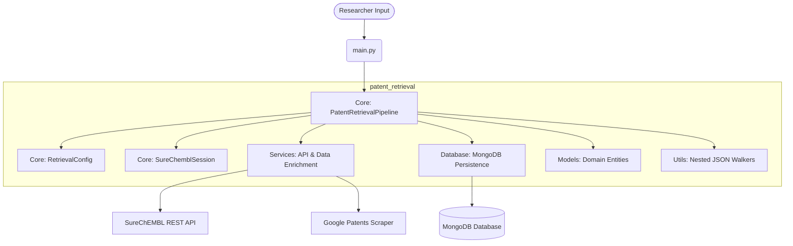

# PatentPilot 🧬🔬
> AI-Assisted Freedom-to-Operate (FTO) Workspace

PatentPilot is a resilient, production-ready pipeline designed to help researchers execute Freedom-to-Operate (FTO) assessments. By inputting a chemical structure (SMILES), researchers can search, retrieve, and automatically enrich patent information to detect intellectual property overlaps early in the drug discovery process.

---

## 🏗️ Overall Architecture

The codebase is organized into modular packages to isolate concerns and support future scalability:



### Module Breakdown
- **`patent_retrieval/core/`**: Orchestration components, session logic, and configuration.
- **`patent_retrieval/models/`**: Domain models (`PatentResult`, `ChemicalMatch`) and progress tracking models.
- **`patent_retrieval/services/`**: Integration services for chemical searches, metadata retrieval, batch fetching, and HTML web-scraping/enrichment.
- **`patent_retrieval/database/`**: MongoDB client setup and document persistence services.
- **`patent_retrieval/utils/`**: Generic helpers for traversing dynamic JSON trees.

---

## 🔍 Retrieval Strategy

1. **Chemical Search**: A SMILES input undergoes basic validation before querying the SureChEMBL database via the `/search/structure` endpoint.
2. **Exponential Backoff Polling**: The pipeline polls the SureChEMBL server status (`/search/{hash}/status`) using a resilient exponential backoff strategy to reduce request congestion.
3. **Chemical-to-Patent Mapping**: Retrieved compounds are mapped to unique patent documents (`/search/documents_for_structures`). The pipeline preserves the Tanimoto similarity score from the compound to the matching patent.
4. **Resilient Chunked Batch Fetching**: Full patent data is fetched using `/document/batch` in small, isolated chunks. If any chunk fails, the error is isolated, and the pipeline continues processing remaining batches.

---

## 🤖 AI Workflow & Enrichment

When SureChEMBL fails to provide an abstract for a patent, PatentPilot invokes its enrichment pipeline:
- **Fallback to Google Patents**: It constructs the Google Patents URL for the patent.
- **Defensive Scraping**: Downloads the HTML and attempts to parse the embedded `application/ld+json` structured data.
- **RegEx Tag Parsing**: If JSON-LD isn't found, it falls back to parsing the `<meta name="description">` tag using regex to find the abstract.
- **Source Attributing**: Back-filled results have their `source` updated to `"Google Patents"`.

---

## 🛠️ Technologies Used

- **Python >= 3.14**: Core backend language.
- **MongoDB**: Schema-less database suited for storing variable metadata and raw patent dumps.
- **requests**: Standard library alternative for network requests.
- **pytest**: Lightweight test runner for validation.
- **uv**: Package installer and virtualenv manager.

---

## 📋 Assumptions & Trade-Offs

### Assumptions
- **Patent Number Formats**: Hyphens and spaces in publication references from SureChEMBL are stripped to match the canonical Google Patents lookup path (e.g. `US-12345-A1` -> `US12345A1`).
- **Score Mapping**: If a patent matches multiple compounds, it inherits the similarity score of the most similar compound (the maximum score).

### Trade-offs
- **HTML Parsing**: Using regular expressions and simple JSON-LD scraping for Google Patents avoids heavy library dependencies (like BeautifulSoup), but is sensitive to changes in Google Patents' frontend DOM layout.
- **Chunked Pagination**: Batching requests is capped sequentially to prioritize rate-limiting friendliness over parallel fetching.

---

## 🚀 Running the Project Locally

### 1. Prerequisites
Ensure you have [uv](https://github.com/astral-sh/uv) installed.

### 2. Setup Database Connection
Create a `.env` file at the project root and add your MongoDB connection string:
```env
MONGODB_URI=mongodb+srv://your-uri
```

### 3. Install Dependencies
Initialize the virtual environment:
```bash
uv venv
source .venv/bin/activate
uv sync
```

### 4. Execute Pipeline
Run the main script:
```bash
uv run main.py
```

### 5. Run Test Suite
Run tests with `pytest`:
```bash
uv run pytest
```
